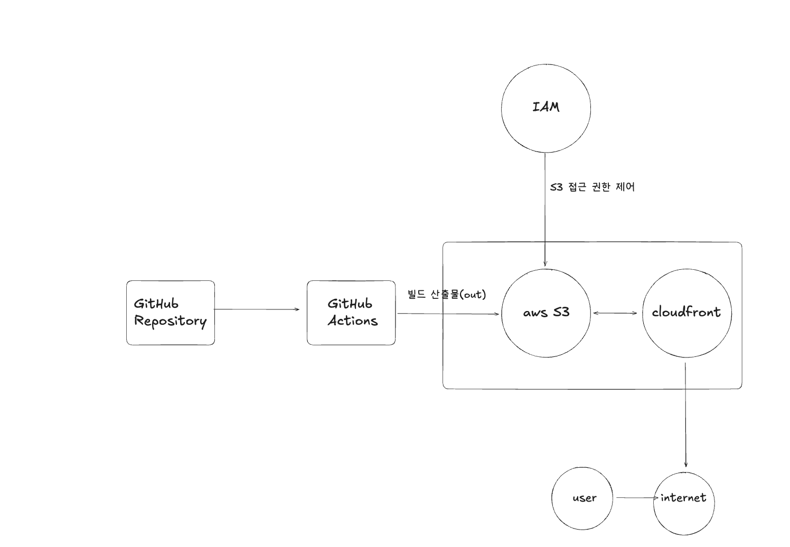

S3 버킷 웹사이트 엔드포인트: [웹사이트 링크](http://hsw-bucket.s3-website-ap-southeast-2.amazonaws.com/)
CloudFront 배포 도메인 이름: [배포 도메인 링크](https://d6pp32oucgr56.cloudfront.net)

## GitHub Actions과 CI/CD

- CI의 뜻은 지속적 통합이고, CD는 지속적 배포라는 뜻 입니다.
- 실제 운영하고 있는 사이트에 수정사항이 생기면, 코드를 수정하고, 빌드를
  하고, 빌드된 산출물에 오류가 없는지 확인한 다음 산출물을 웹 서버에 올리는
  과정을 반복해야 합니다. - 이런 과정을 반복하면 너무 비효율적이기 때문에, 코드를 빌드하고 테스
  트 하는 자동화 프로세스가 필요합니다. 이를 CI라고 합니다. - 또한, 빌드된 결과물을 자동으로 배포하는 과정을 CD라고 합니다.
- GitHub Actions를 이용하면 CI/CD 작업을 자동화할 수 있습니다.
  GitHub Actions는 특정 트리거가 발동했을 때, 미리 지정한 워크플로우를 실
  행시키는 자동화 툴입니다. - main 브랜치에 push하거나 pull request가 생성될 때 자동으
  로 워크플로우가 실행됩니다.

## Repository secret과 환경변수

- 일반적으로 api키나, password, 회사에서 보안이 필요한 키값 등 환경변수
  의 경우는 .env파일을 만들어 저장하고 GitHub에 직접 업로드하지 않습니다.

- 하지만 GitHub Actions으로 CI/CD를 자동화 한 경우 .env파일이 없기 때
  문에 빌드나 테스트에 오류가 있을 수 있습니다. 그렇다고 민감한 정보를
  GitHub에 업로드할 수도 없습니다.

- 이를 해결하기 위해 GitHub는 secret 기능을 제공하고 있습니다.
- GitHub의 Repository Secrets에 민감한 정보를 저장하고, 워크플로우에
  서 이를 이용해 .env 파일을 생성하는 스크립트를 작성할 수 있습니다.

## S3와 스토리지

- AWS의 S3는 빌드된 정적 파일을 객체 단위로 저장합니다.
- 관련된 객체들을 하나의 버킷으로 관리합니다.
- 버킷을 정적 웹사이트 호스팅에 사용합니다.
- 정적 웹사이트를 별도의 웹 서버 구축없이 배포할 수 있습니다.
- CloudFront cdn와 연계하면 더 빠른 페이지 로딩이 가능합니다.
- S3는 기본적으로 HTTP만 지원하며, HTTPS 요청은 응답하지 못합니다.
  (이를 해결하기 위해서 CloudFront과 연동해서 뷰어 프로토콜 정책으로 Redirect HTTP to HTTPS를 설정해야합니다.)

- 제가 사용했을 때 느낀것은 웹 서버 없이 파일 업로드만 했는데,
  웹 사이트 배포가 가능한것 같아 보였습니다.

이 같은 동작이 가능한 이유는 다음과 같습니다.

1. S3가 자체적으로 HTTP요청을 처리
2. 정적 웹 호스팅 기능 활성화로 index.html 연결
3. 서버 사이드 처리가 필요 없는 정적 파일이라서 가능

## CloudFront와 CDN

- CDN은 전 세계에 분산된 서버 네트워크를 이용해서 사용자에게 더 빠르게 웹 페이지를 제공하는 시스템 입니다.
- CDN을 이용하면 웹 사이트 로딩이 빨라지고 서버의 부하가 줄어듭니다.
- AWS는 CloudFront를 통해 CDN 기능을 제공합니다.

CDN의 기본 개념

- 하나의 서버로 모든 요청을 처리한다면, 물리적으로 거리가 먼 경우 응답 시간이 길어지고 로딩 속도가 저하됩니다.
- 이를 개선하기 위해 콘텐츠를 제공하는 서버를 여러 지역에 두고, 사용자에게 가까운 서버에서 웹 사이트를 제공하는 구조를 CDN이라고 합니다

CDN의 구성 요소

1. Origin 서버 : 원본 콘텐츠를 보관하는 서버
2. Edge 서버 : 사용자와 가까운 위치에 있는 CDN서버. 초기 콘텐츠가 없을 경우 Origin 서버에서 컨텐츠를 가져와 사용자에게 전달하고, 캐시합니다.
3. 캐시 : Edge 서버가 가지고 있는 정적 파일(이미지, js, css 등)

## 캐시 무효화( [CloudFront 및 S3에서 계층형 TTL을 사용하여 단일 페이지 애플리케이션(SPA) 호스팅](https://aws.amazon.com/ko/blogs/networking-and-content-delivery/host-single-page-applications-spa-with-tiered-ttls-on-cloudfront-and-s3/)을 보고 정리했습니다.)

- 정적 웹사이트(SPA)를 배포할 때는, 성능을 높이기 위해 CDN 캐싱을 사용합니다. 하지만 캐싱이 잘못 설정되면, 사용자가 오래된 화면을 계속 보게 되는 문제가 생깁니다.
- 이를 해결하기 위해 CloudFront + S3 조합에서는 “캐시 무효화 없는 배포 전략”을 사용할 수 있습니다.

### 파일별 TTL 분리

index.html
→ 파일 이름은 항상 같으므로 짧은 TTL(예: 60초) 설정
→ 자주 재검증되며, 변경되면 새로 다운로드됨

main.[hash].js, style.[hash].css
→ 파일 내용이 바뀌면 이름도 바뀜
→ 긴 TTL(예: 1년) 설정해도 문제 없음
→ 변경되면 새로운 이름으로 요청되므로 캐시 무효화가 불필요

### ETag

- ETag는 S3가 업로드된 각 객체에 대해 자동으로 부여하는 버전 식별자입니다. 파일 내용이 바뀌면 ETag도 변경됩니다.
  - 사용자의 브라우저가 이미 index.html을 캐시하고 있는데, TTL이 만료되었다면, 브라우저는 캐시된 파일의 ETag를 If-None-Match 헤더에 담아 CloudFront에 조건부 요청을 보냅니다. CloudFront/S3는 현재 파일의 ETag와 비교하여 응답합니다.

1. ETag가 동일함 : 304 Not Modified 응답으로 브라우저가 갖고 있는 파일을 그대로 사용
2. ETag가 다름 : 200 OK 응답과 함께 파일이 바뀌었으므로 최신 버전 제공

### stale-while-revalidate로 사용자 경험 향상

- stale-while-revalidate는 오래된 캐시를 먼저 보여주고,
  백그라운드에서 최신 파일을 받아오는 HTTP 캐시 전략입니다. -사용자는 기다리지 않고 즉시 화면을 보며, 다음 방문 때는 백그라운드에서 받아둔 최신 버전이 자동으로 반영됩니다.
